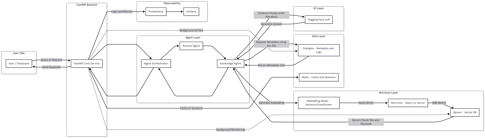

# 🤖 Multi-Agent AI Knowledge Assistant System  
## Cloud-Deployed Retrieval-Augmented Generation (RAG) Platform

A production-style multi-agent AI knowledge assistant that retrieves relevant information from documents using semantic search and generates accurate answers using large language models.  
The system is containerized, observable, and deployable locally via Docker or in the cloud using AWS + Terraform.

---

## 🚀 Key Features

- Multi-agent architecture (Orchestrator, Planner Agent, Knowledge Agent)
- Retrieval-Augmented Generation (RAG) pipeline
- Semantic search with vector embeddings
- FastAPI backend
- Qdrant vector database
- PostgreSQL for metadata & logging
- Redis for caching and sessions
- Hugging Face LLM integration
- Dockerized microservices
- Infrastructure-as-Code with Terraform
- Cloud deployment on AWS (ECS, ECR, ALB, VPC)
- Monitoring with Prometheus & Grafana
- CI pipeline with GitHub Actions

---

## 🧠 System Architecture



**High-level flow:**

User ↓  
FastAPI Backend ↓  
Agent Orchestrator ↓  
Planner Agent → Knowledge Agent ↓  
Embedding Model → Qdrant Vector DB ↓  
Retrieved Context ↓  
Hugging Face LLM ↓  
Final Answer

---

## 🛠️ Tech Stack

### Backend & AI
- Python
- FastAPI
- Hugging Face Transformers
- SentenceTransformers

### Databases
- Qdrant (Vector DB)
- PostgreSQL
- Redis

### DevOps & MLOps
- Docker & Docker Compose
- Terraform
- AWS (ECS, ECR, ALB, VPC)
- GitHub Actions (CI)

### Observability
- Prometheus
- Grafana

---

## 📁 Project Structure
```
agentdesk-pro/
│
├── services/
│   ├── api/            # FastAPI app
│   ├── agents/         # Orchestrator, planner, knowledge agents
│   ├── ingestion/      # Data ingestion scripts
│   ├── tools/          # Agent tools
│   └── vision/         # Optional OCR / vision modules
│
├── infra/              # Terraform infrastructure
├── sample_docs/        # Example documents
├── scripts/            # Utility scripts
├── docker-compose.yml
├── Dockerfile
├── requirements.txt
├── .env.example
└── README.md
```

---

## ⚙️ Environment Setup

Create a `.env` file using the template:
```
cp .env.example .env
```

Edit values inside `.env`:
```
POSTGRES_USER=agentdesk
POSTGRES_PASSWORD=your_password
POSTGRES_DB=agentdesk
POSTGRES_HOST=localhost
POSTGRES_PORT=5432

HUGGINGFACE_API_KEY=your_key
HUGGINGFACE_MODEL=your_model
```
---

## ▶️ Run Locally (Docker)
```
docker-compose up --build
```
API will be available at:
```
http://localhost:8000
```
Example endpoint:

POST /retrieve
```
Body:
{
"q": "What is the refund policy?"
}
```
---

## ☁️ Cloud Deployment (AWS + Terraform)
```
cd infra
terraform init
terraform apply
```
Terraform provisions:

- VPC & Subnets
- ECS Cluster
- ECR Repository
- RDS PostgreSQL
- Application Load Balancer
- ECS Services

After apply, Terraform outputs the ALB DNS to access the API.

---

## 📊 Monitoring

- Prometheus → http://localhost:9090
- Grafana → http://localhost:3000

Use Grafana dashboards to monitor:

- Request rates
- Latency
- Errors
- Container health

---

## 🧪 CI Pipeline

GitHub Actions automatically:

- Installs dependencies
- Runs linting
- Runs tests
- Builds Docker images

On every push and pull request.

---

## 🎯 Why This Project Matters

This project demonstrates real-world skills in:

- AI system design
- Multi-agent architectures
- Vector databases
- Backend engineering
- Cloud infrastructure
- DevOps & observability

It mirrors how modern AI products are built in industry.

---

## 📌 Author

**Bassam Mohammed** 

GitHub: https://github.com/Doodad7  
LinkedIn: https://www.linkedin.com/in/bassam-mohammed-ba3284315/
